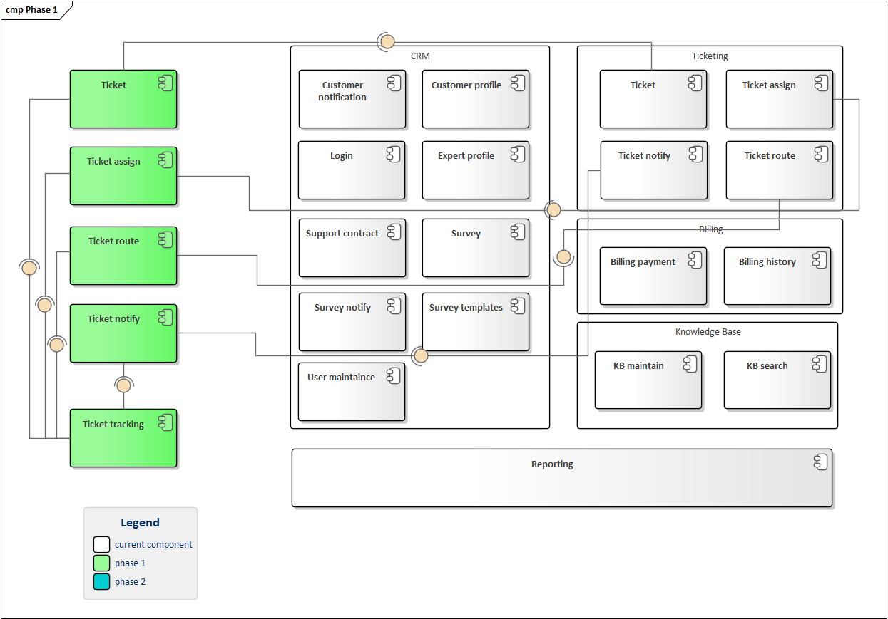
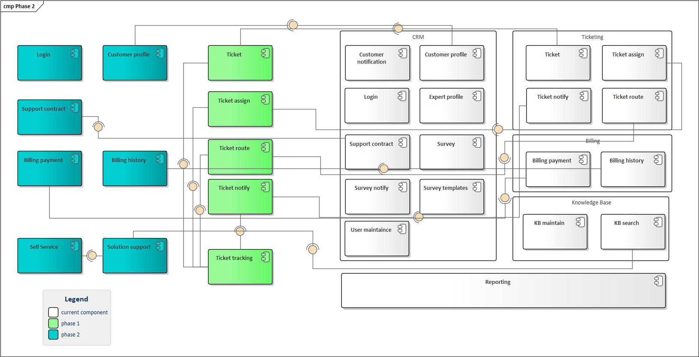

ADR-01 Migration steps

# Status

Proposed

# Context

Time constraints determine the need to deliver part of the functionality as early as possible.

Thus, it is required to determine which functionality and in what sequence to deliver the solution to the production environment.

## Options

1. Complete replacement of the entire solution
2. Separating part of the functionality into separate services. At the same time, some of the functions will stay in the old solution at the initial stages

# Decision

Replacing all functionality will take a long time. So in the first stages, part of the solution will remain on the existing solution.

The old components remain in the solution and are not removed from production. They are used for the correct operation of components that are not migrated to the target architecture in the first stages.

## Phase 1

The following components need to be changed first:

### Ticket registration and tracking

Complaints from customers and call center operators about the inaccessibility of registration and missing tickets determine the high priority of changing the components responsible for registration and ticket tracking

Determines the need to implement a high availability registration and ticket tracking component.

### Ticket assignment and routing

Cases in which a consultant comes in unable to solve a customer's problem require the implementation of a component that manages the assignment and routing of tickets

### Monitoring

Traceability requirements determine the presence of components responsible for monitoring the performance of nodes

## Phase 2

Planned changes in the second phase

* Customer information management
* Solution support component
* billing and payment

The second priority is determined by the following factors:

* These functions are used less frequently and do not require high availability at the moment
* These components are not critical to achieving the project goals at this time

## Phase 3

And last stage contains migration of the remaining part to the new architecture:

* Knowledgebase components
* User maintenance
* Survey components

# Consequences

The first two stages will require integration of new components with the current solution.

Replacing some of the components will require working through the migration of old data to the new stores.
