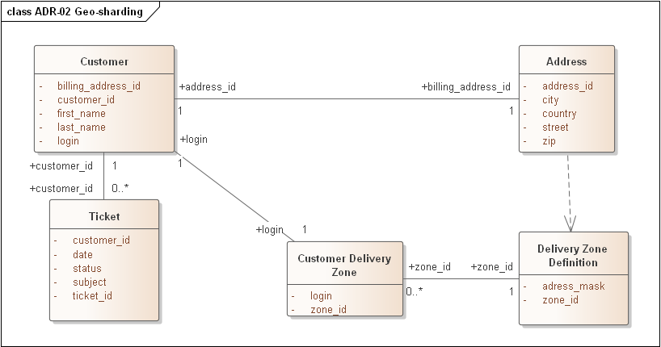
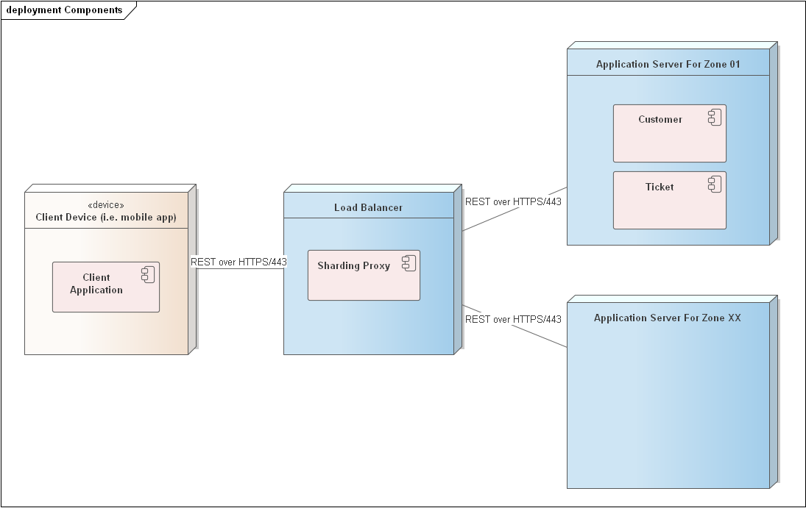
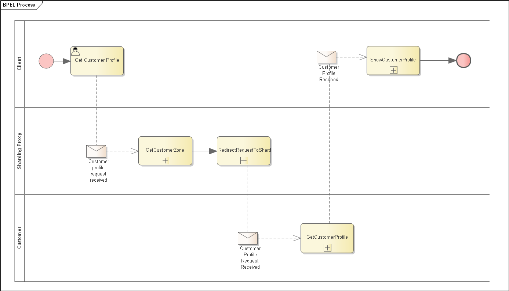

ADR-02 Geo-sharding

# Status

Propose

# Context

According to the assignment, the company has customers all over the country. In order to increase the availability of the system and, at the same time, to increase productivity, it is proposed to use directory bases sharding pattern to scale the storage of data about users and tickets.

In directory based sharding we need some structure to define the sharding rules.

# Decision

We have allocated separate delivery zones for data grouping. We will adjust them depending on the amount of data in the specific regions. The address_mask attribute will be responsible for this. With it we will be able to group delivery zones to the exact city, state or zip.

Data structure for Customer and Ticket data.

Queries to find a customer will first have to refer to the Customer Delivery Zone table to determine the desired Shard and then refer to the desired data.

Similarly, when searching for information about a Ticket, you will need to first identify the customer and understand the Shard where the information is stored for him, then refer to the right Shard.

A schematic diagram of component interaction

Example of interaction workflow

# Consequences

The advantages of this approach include:

* We don't need to come up with separate key hashing logic as in other sharding options;
* The sharding logic coincides with the business logic of the application, which minimizes the probability of resharding;
* Resharding may be needed when splitting zones into smaller ones, thus not affecting large amounts of data (we need to move only the data of a split zone);

Cons:

* There is a possibility that we will make a mistake and some zones will have very few customers and nodes will not be filled;
* There is an additional bottleneck in the queries - to read the information by zone. If the mapping table is not available - the system will not be able to respond to all requests. That's why it has to be replicated.