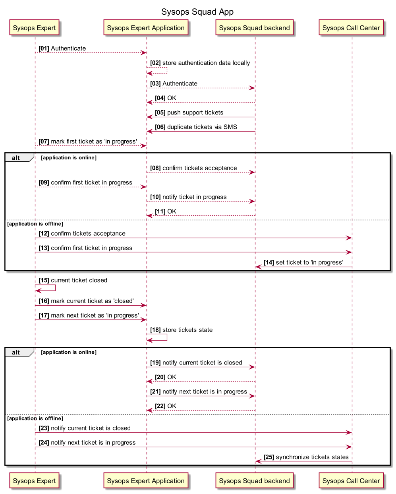
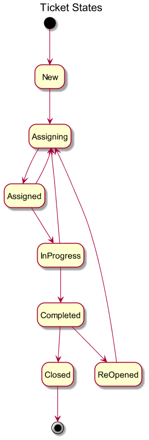
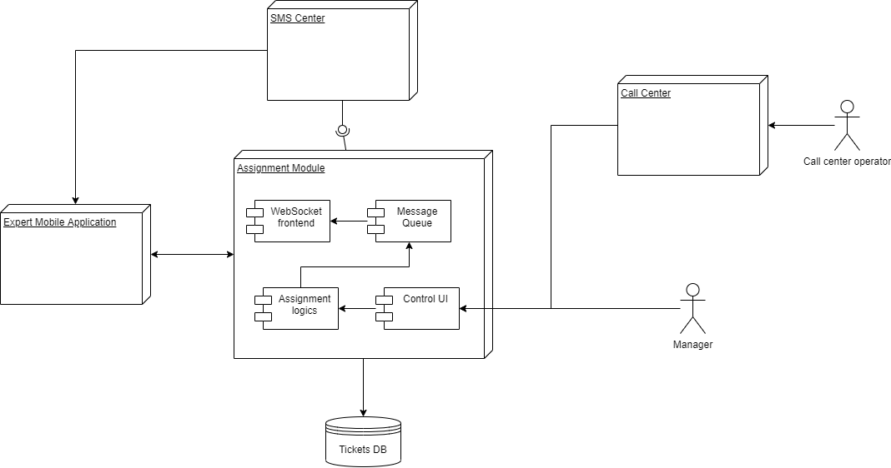

ADR-04 Durable messaging with mobile clients

№ Status
Propose

№ Context
Mobile phone application can be very unstable in work (dead battery, poor network, ...) so we need solution for delivery tickets and ticket resolve status to mobile application and back.

№ Decision
A support ticket is assigned to an expert once he starts his working day, or during his work on the current ticket. The assigning system makes sure that each expert has at least three tickets in his queue (if there are enough tickets overall). This is required so that the expert can continue with the next ticket even without cellular coverage.

To ensure tickets aren't lost when being assigned to experts, confirmation is required from the application upon receiving a ticket.

After the ticket is assigned, the expert must confirm, using the application, that he's on his way to the next client. If the backend is unavailable, the expert must mark the ticket locally as 'in progress'. The app must remember this choice and notify the backend once it is available once again. At the same time, the expert should try to call the call center and set the ticket to 'in progress' on the backend via a call center. If there's absolutely no cellular coverage, the expert must still proceed to the next client, expecting that the notification will occasionally be sent by the app to the backend in the background.

New incoming tickets are duplicated via SMS with basic data sufficient to route the expert to the client. SMS, having a specific format, are read by the application and imported as tickets. SMS for tickets already delivered over the data network are ignored, and vice versa.

The assigning system can re-assign any ticket to another expert, if there are specific conditions for that. For example, a ticket is overridden by manager, or another expert has finished his current task and doesn't have a new one. The app of the expert must then be notified that a ticket has been re-assigned, using the same SMS/push mechanism as for importing ticket into the app.

The re-assignment isn't fully transactional, but must at least first be assigned to the different expert. Notifying the originally picked expert of the ticket being re-assigned becomes a matter

The ticket has several possible states:

'new' - the ticket is registered in the system, but not yet assigned. Can be only changed to 'assigning'.

'assigning' - a purely server-side ticket state when ticket acceptance has not yet been confirmed by an expert. It has a reasonable timeout after which another expert is picked to be assigned with the ticket.

'assigned' - the ticket is assigned to a specific expert, but work is not yet started. Can be changed to 'in progress' and 'assigning'.

'in progress' - the expert is on his way to the client or is already fixing the issue. Can be changed to either 'completed' (the expected flow) or 'assigning', if, by some reason, the ticket needs to be re-assigned to another expert.

'completed' - the expert finished with the issue and is ready to continue with the next tixket. Can be changed to 'closed' or 're-opened'.

're-opened' - the client thinks the expert hasn't fixed the issue. Can be only changed to 'assigning'

'closed' - the client has confirmed that the issue is fixed and filled out a survey OR the ticket has been in 'completed' state for some reasonable time (a month, for example) with no feedback from the client. Cannot be changed.

Technically, the system consists of a assignment logics module, a MQ to offload the DB and store the tickets to be synchronized to the online application, and a Websocket frontend, which allows pure two-way communication which is required for the ticket data exchange.

Consequences
Cons:

Confirmation requires cellular coverage sufficient to at least make a call.

Re-assignment of tickets has a weak spot - there's a slim possibility that the expert cannot be notified that he now has one less ticket if he's out of cellular coverage, which potentially leads to several experts coming to fix the same problem.

Pros:

SMS/internet ticket delivery duplication minimizes the chances of losing a ticket.

Confirmation allows notifying the client only when an expert is on his way to the customer.

Several experts coming to fix one problem is still better than no expert arriving at all.