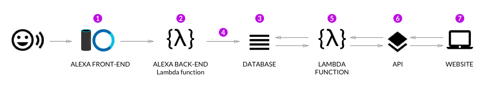

ADR-05 AR self-service application

# Status

Proposed

# Context

A lot of simple cases can be closed by customer himself with support of smart client application empowered with AR technology.

# Decision

клиентское приложение, взаимодействие с knowledge base, помощь в решении проблем с помощью AR Цуприков Сергей Васильевич

The goal of AR self-service application in this project is a mitigate the pain points with frequent service visits and customer waiting time. There are many possible options proposed in this way, see below.

## Option 1

1st is a scan of fault device QR code, part number (P/N), bar code (selection one or more from this list is depends from specific fault device) by customer smartphone for estimation it is Customer Replacement Unit (CRU) as a spare part or not. Customer can held a small local DB, f.e. based on SQlite, on smartphone with list (and possible some pictures) of CRU units. If smartphone recognized units as a CRU, customer can replace it himself after delivery CRU from nearest spare parts warehouse or getting ones by parcel service like Federal Express. The some smartphone also can recognized a fault device type and automatically get a link to external web catalog  with device description.

## Option 2

2nd option is using a chat bot or other virtual assistant like Amazon Alexa based on Natural Language Processing (NLP). Customer can input a model name or P/N of fault device for getting some simple questions like already stored FAQ. If a chat bot can`t help to resolve an incident, it automatically can prepare a service ticket based on the last conversation with customer. Also in many cases so called a hybrid chat can be realized. If a chat bot can`t answer fast enough it will switch immediately to human operator.

## Option 3

Some internal web based communities like end user forums also can assist customers in many service problems. Same AR self-service applications can be deployed in Intranet as a wiki or in some external cloud as SaaS. The AR self-service applications need to be developed with a user friendly interface for easy to use navigation. All local AR applications will be integrated with a centralized Knowledge Вase (KB) for getting answer to customer as fast as possible. Any king of voice technology like a Google Assistant can significantly increase a user experience for solving a typical service problems, f.e. to realize a voice command from customer to chat bot.

# Consequences

The advantages of this approach include:

- Customers waiting time for serice delivery cutting;
- Waiting time of spare part delivery cutting;

- Service operator worlkload will be cutting in several time;
- Service ticket will be more clear and detailed.

Cons:

- There is a possibility in the 1st option that we will get some customer mistakes for ordering CRU;
- There is an additional bottleneck in the 1st option - customer must to have possibility to use own smartphone for QR code, part number (P/N), bar code scanning.
