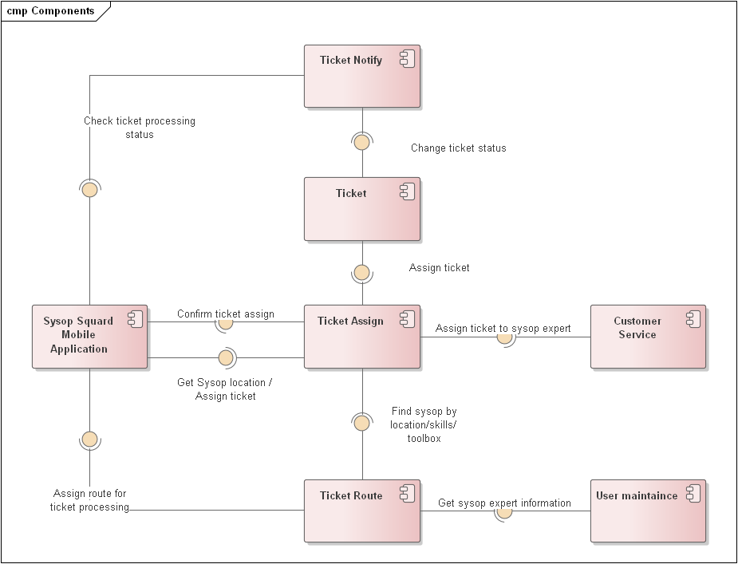
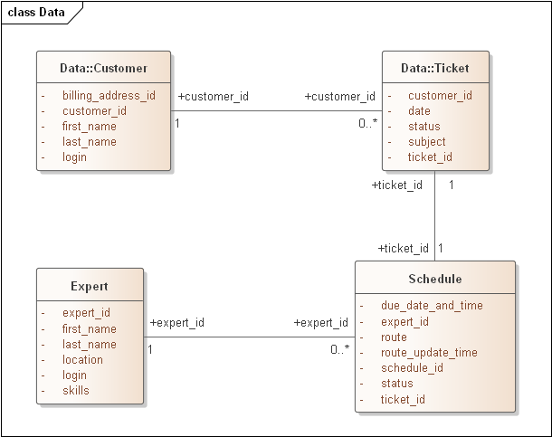

ADR-06 Workforce smart routing

# Status

Proposed

# Context

We need smart navigation system for creation optimal route path for sysops specialist. The reason is to shorten customer wait time, and to handle more the one ticket in one trip.

# Decision

The main task within this ADR is to create a mechanism for optimal loading of experts in order to serve more customers and minimize delays.

Routes for experts can be assigned at any time, as well as a specific ticket can change the expert. This can happen if the expert is caught in a traffic jam, or was delayed on a previous order. In this case, his orders will be distributed among other available experts nearby.

Since the route will change dynamically, it is important for us to keep the status and history of the Schedule for the expert.

# Consequences

Since the scheme of assigning tickets to experts becomes dynamic, it will make it more difficult to track the status of ticket processing.
On the plus side, we reduce the probability of customer dissatisfaction.