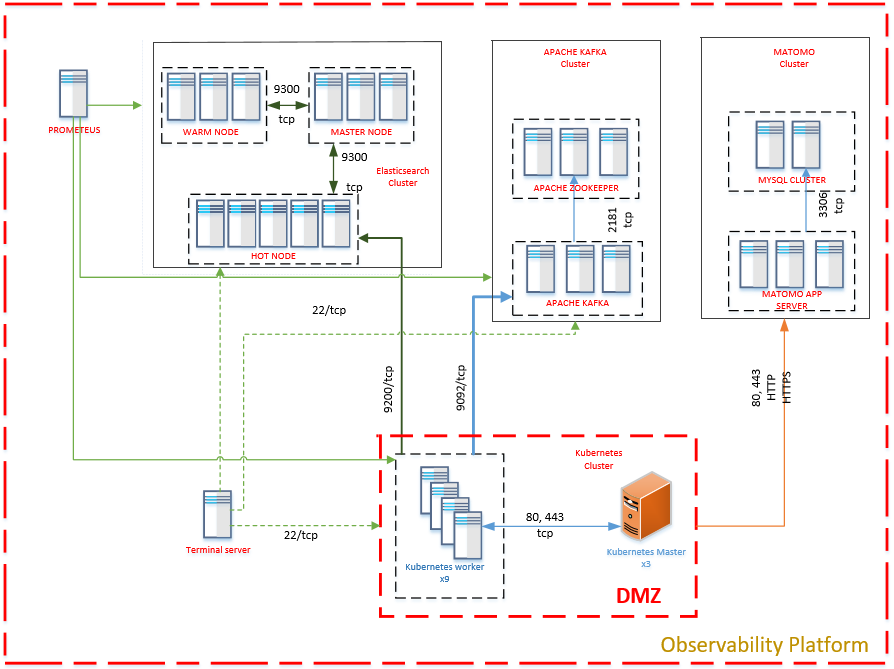

ADR-08 Monitoring

# Status

Propose

# Context

Improve request traceability and overall monitoring of system healthiness

# Decision

According to the assignment, the company has customers which complain for many maintenance (i.e. service and suport) issues. In order to increase the a total availability and traceability issues the global monitoring solution is proposed.  All logs from customer devices and other IT systems will be collected in single area called Observability Platform (OP). It was based on several cluster technologies and include full ELK stack, plus Zabbix, Prometheus, Grafana and other software packages. The main goal of OP is collect of all major IT infastructure parameters: logs, traces, metrics.

In case of collection logs from customer smartphones or other mobile devices, customer send logs by using HTTPS to front end (FE) of client logging module. After customer logs come to MQ Broker like RabbitMQ, special adapter transmits it to Elasticsearch engine (with full text search possibilities) in Observability Platform. Prometeus will be used for metrics and alerts creation and Grafana - for dashboard visualization of metric results.

API OpenTracing will be used as a standart for connection to Observability Platform.  See below the proposed draft network diagramm of OP.

Possible metrics of Observability Platform:

* Time delay of cluster heartbeat;
* The number of all errors;
* The number of errors with 500 code;
* The number of errors related to unsuccessful API code;  
* Host unavailable during 10 minutes;
* The number of spans growth more than XXX during 5 minutes.

# Consequences

The advantages of this approach include:

* Get a full picture of device and IT systems health;
* Improve the overall uptime period;
* Organize a proactive technical support;

Cons:

* It will increase a complexity of full solution proposed;
* There is an additional bottleneck in the solution - Observability Platform can be the Single Point of Failure (SPOF).