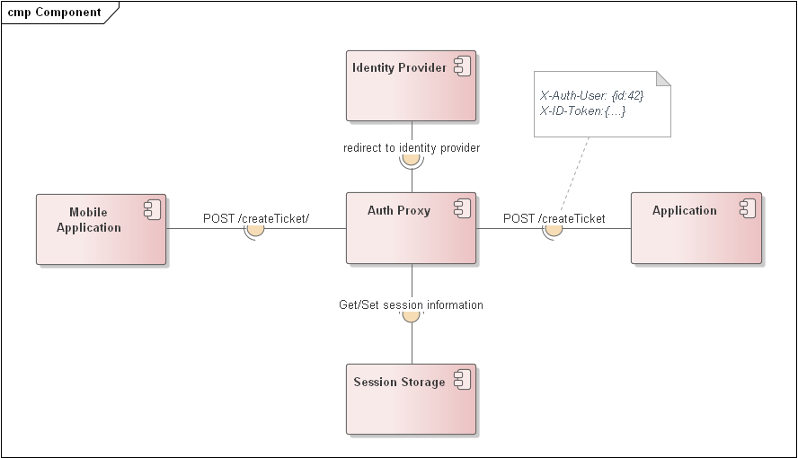
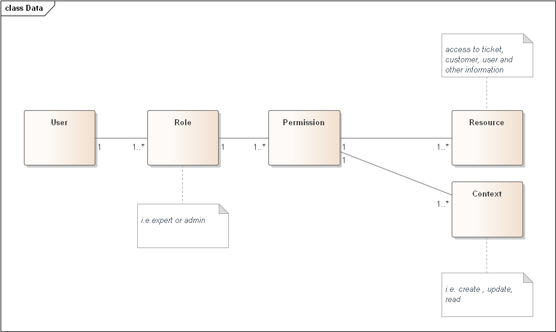

ADR-09 Security

# Status

Propose

# Context

The system stores several types of data subject to special protection:

- Customer data
- Financial transaction data
- Expert data

# Decision

We will apply the following set of tactics:

- multi-factor user authentication
- user authorization (since we have different roles: client, expert, administrator)
- Data channel encryption
- Keeping audit logs of data changes in separate storages
- creating a DMZ for interacting with mobile apps of experts/users

A simple role-based security model will be applied to ensure user authentication. All users will be divided into roles and each role will be assigned rights to certain entity operations. Security data must be stored in a separate repository.

# Consequences

These tactics should help avoid the following attacks:

- Interception
- Modification in Place or in Transit
- Man-in-the-Middle
- Exploit of Incomplete Traceability
- Exploit of Incomplete Authentication or Authorization