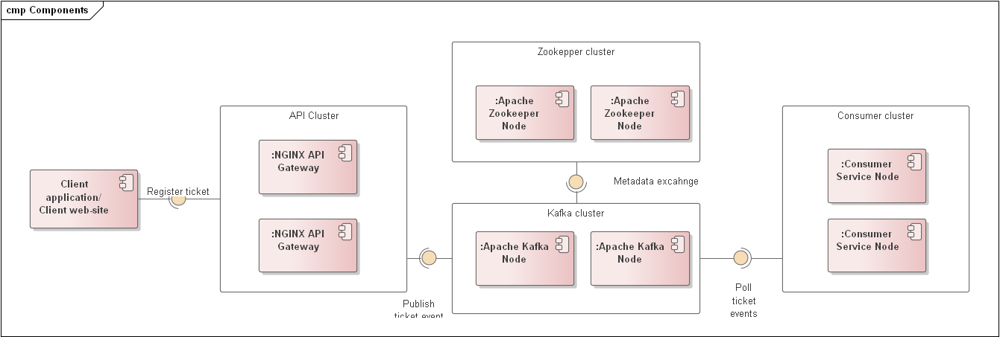

ADR-10 Ticket Spike

# Status

Propose

# Context

An overspike in customer requests related, for example, to defects in the equipment being sold.

# Decision

Using event-driven architecture procedures to smooth out load peaks and increase system elasticity together with the CQRS pattern.

# Consequences

A plus is the ability to flexibly scale the event processing system and solve the problem of jumps in the number of new event registrations.

The minus is that the solution is more complicated and the information about the registered ticket may not be immediately available on the site (due to the peculiarities of CQRS).