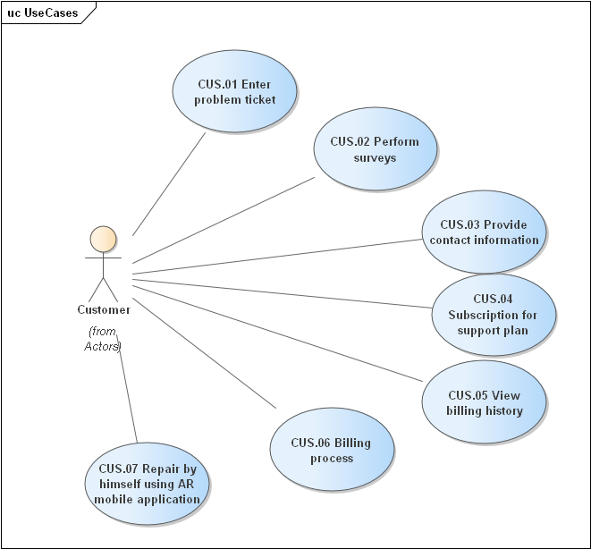
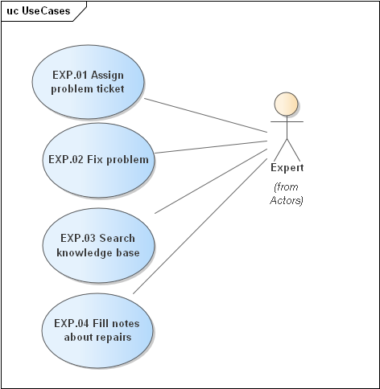
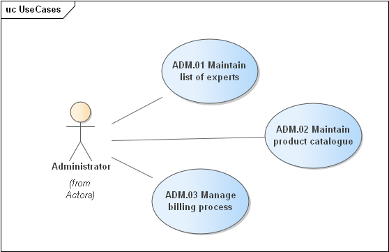
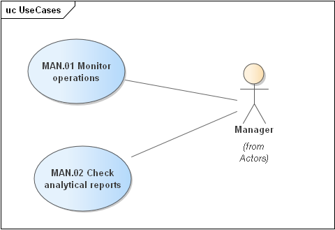
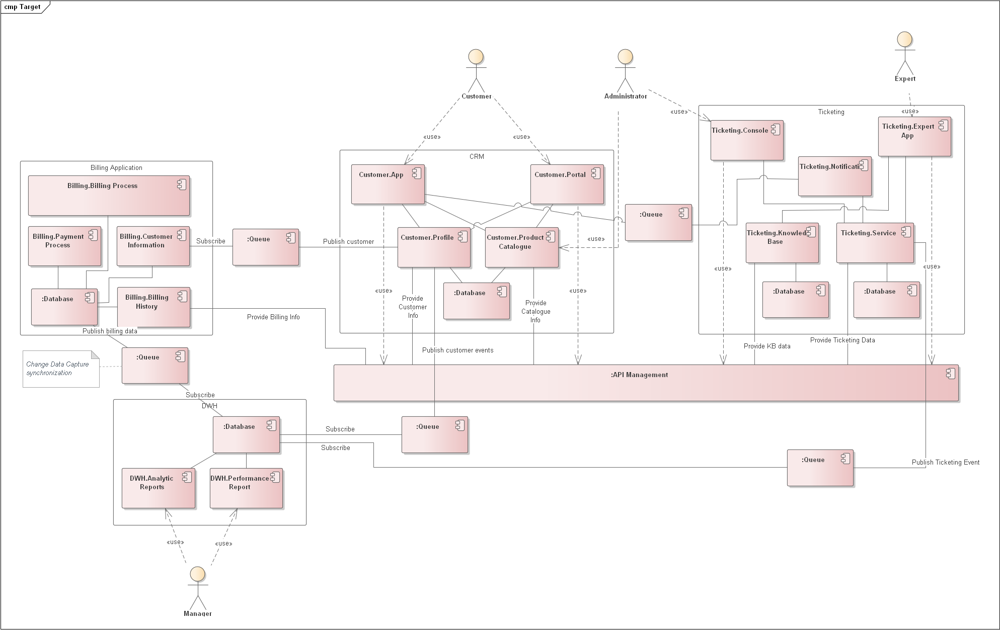
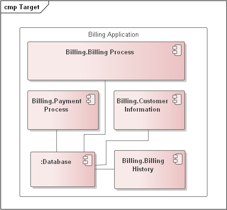
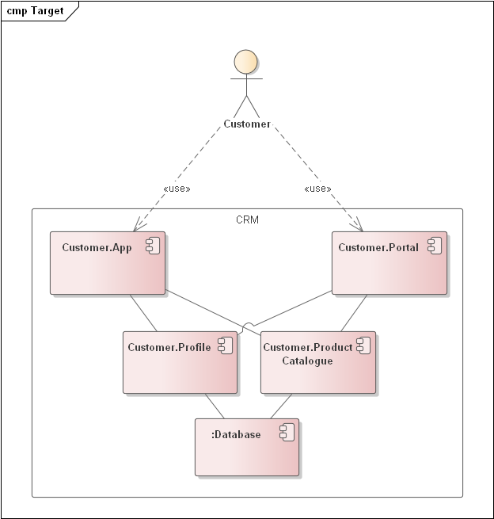
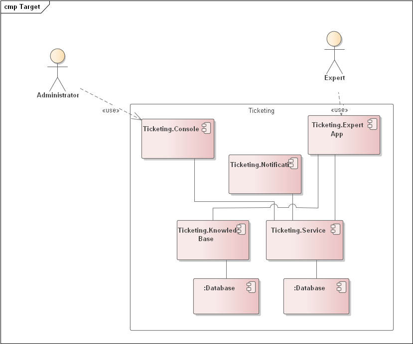

Vision

# Business motivation

## Drivers

keep business running

## Objectives

* system availability > 99%
* ticket loss probability < 0,01%
* no observable for user system freezes
* incident investigation time no more than 4h for critical issues

# Architecture Goals

Based on analysis of current issues and main use cases, the following main architectural characteristics were defined for the refactored system:

1. availability
2. reliability
3. traceability
4. scalability

Since the main business process won't start until there's a new ticket in the system, we assign availability the top priority. The user must be able to submit a support ticket no matter what 24x7 - either online or via a phone call (which still requires the system to be available for call center staff). Second in priority is reliability, because crashes and freezes occur regularly with the current system. This causes delays in customer service and possible loss of tickets, which is also stated as a painpoint of current architecture. Next, the system should be traceable so that ticket loss or other dataflow related problems can be easily found and solved. Finally, the system should be scalable to some extent so that expansion to new regions, for example, isn't an issue.

# Use cases

## Customer use cases

## Expert use cases

## Administrator use cases

## Manager use cases

| №  | Use case                                             | Source                                                                                                                                                                                                                                                                                                                                                                         | Is ASR?                                                                                                                         |
|----|------------------------------------------------------|--------------------------------------------------------------------------------------------------------------------------------------------------------------------------------------------------------------------------------------------------------------------------------------------------------------------------------------------------------------------------------|---------------------------------------------------------------------------------------------------------------------------------|
| 1  | ADM.01 Maintain list of experts                      | The administrator user maintains the internal users of the system,  including the list of experts and their corresponding skillset,  location, and availability. The administrator also manages all of  the billing processing for customers using the system, and maintains  static reference data (such as supported products, name- value pairs  in the system, and so on). | No This data changed not very  often so if we have no bugs  in system, all should be fine.                                      |
| 2  | ADM.02 Maintain product catalogue                    | The administrator also manages all of the billing processing for customers using the system, and maintains static reference data (such as supported products, name- value pairs in the system, and so on)                                                                                                                                                                      | No  This data changed not very often so if we have no bugs in system, all should be fine.                                       |
| 3  | ADM.03 Manage billing process                        | Overall control of billing procedure.                                                                                                                                                                                                                                                                                                                                          | No This procedure should be performed fully automatically.                                                                      |
| 4  | CUS.01 Enter problem ticket                          | Customers enter problem tickets into the system, and also fill out surveys after the work has been completed.                                                                                                                                                                                                                                                                  | Yes We need to simplify procedure of all customer interaction, and make it fast and available.                                  |
| 5  | CUS.02 Perform surveys                               | Customers enter problem tickets into the system, and also fill out surveys after the work has been completed.                                                                                                                                                                                                                                                                  | No Survey is not urgent operation.                                                                                              |
| 6  | CUS.03 Provide contact information                   | The customer registers for the Sysops Squad service, maintains their customer profile, support contracts, and billing information.                                                                                                                                                                                                                                             | No This data changed not very often so if we have no bugs in system, all should be fine.                                        |
| 7  | CUS.04 Subscription for support plan                 | Customers register with the Sysops Squad system and have multiple support plan.                                                                                                                                                                                                                                                                                                | No This data changed not very often so if we have no bugs in system, all should be fine.                                        |
| 8  | CUS.05 View billing history                          | Customer can view billing history in client application/customer support site or request information by email.                                                                                                                                                                                                                                                                 | Yes We need to simplify procedure of all customer interaction, and make it fast and available.                                  |
| 9  | CUS.06 Billing process                               | Customers are automatically billed monthly based on credit card                                                                                                                                                                                                                                                                                                                | No This operation is monthly based, so the only requirement is to create it reliable and secure                                 |
| 10 | CUS.07 Repair by himself using AR mobile application | Customer can use our new AR application to fix small issues by himself. It's good for improvement of customer experience.                                                                                                                                                                                                                                                      | No This is some value-added service that is fully optional.                                                                     |
| 11 | EXP.01 Assign problem ticket                         | Experts are assigned problem tickets and fix problems based on the ticket. Once assigned, the problem ticket is uploaded to a dedicated custom mobile app on the Sysops Squad expert’s mobile device. The expert is also notified via a text message that they have a new problem ticket.                                                                                      | Yes We need this operation to become reliable and consistent.                                                                   |
| 12 | EXP.02 Fix problem                                   | Experts are assigned problem tickets and fix problems based on the ticket                                                                                                                                                                                                                                                                                                      | Yes We need this operation to become reliable and consistent.                                                                   |
| 13 | EXP.03 Search knowledge base                         | They also interact with the knowledge base to search for solutions to customer problems and also enter notes about repairs.                                                                                                                                                                                                                                                    | No Knowledge base stories static data with low rate of change. We just need to make it available.                               |
| 14 | EXP.04 Fill notes about repairs                      | They also interact with the knowledge base to search for solutions to customer problems and also enter notes about repairs.                                                                                                                                                                                                                                                    | No Knowledge base stories static data with low rate of change. We just need to make it available.                               |
| 15 | MAN.01 Monitor operations                            | The manager keeps track of problem ticket operations and receives operational and analytical reports about the overall Sysops Squad problem ticket system                                                                                                                                                                                                                      | Yes We want to control all situation with tickets. So this case is important for purpose of observability and data consistency. |
| 16 | MAN.02 Check analytical reports                      | Manager can check any types of reports to be sure that all system processes in good condition.                                                                                                                                                                                                                                                                                 | No This operation is for controlling of system health in addition to automatic checks.                                          |

# Solution

Overall module architecture modules

The main idea of the division into modules is to divide applications by users and areas of reliability. We also consider AD-02 "Geo Sharding" for Customer and Ticketing databases and ADR-03 "Segregate OLAP and OLTP" for all databases.

The following core modules are highlighted:

* Billing Application
* CRM
* Ticketing
* Data Warehouse

Interaction between the modules is realized:

* By events - through message queues;
* By interactive API calls - through API Manager;

## Billing

Modules:

* Billing Process - automation of billing processes in accordance with user subscription plans;
* Payment Process - automation of the process of collecting payments from customers' bank cards;
* Customer Information - storage of payment and billing information;
* Billing History - storage of billing and collection history;

## CRM

Modules:

* App - customer self-service applications with augmented reality features;
* Portal - web-applications for customer work (information on subscriptions, possibility to establish tickets...)
* Profile - storage of client information
* Product Catalogue - catalog of products and subscriptions

## DWH

Modules:

* Analytic Report - analytical reporting on finances, client issues, performance, and expert quality (based on feedback from clients)
* Performance Report - operational reporting on the status of the ticket

## Ticketing

Modules:

* Console - an application to manage the process of assigning requests and monitoring their execution
* Expert App - mobile expert application
* Notification - service for controlling changes in the status of requests and informing the Expert Advisor and client about the new status
* Service - service of managing changes in the status of tickets and building optimal routes based on the location of experts
* Knowledge Base - knowledge base for solving customer problems
